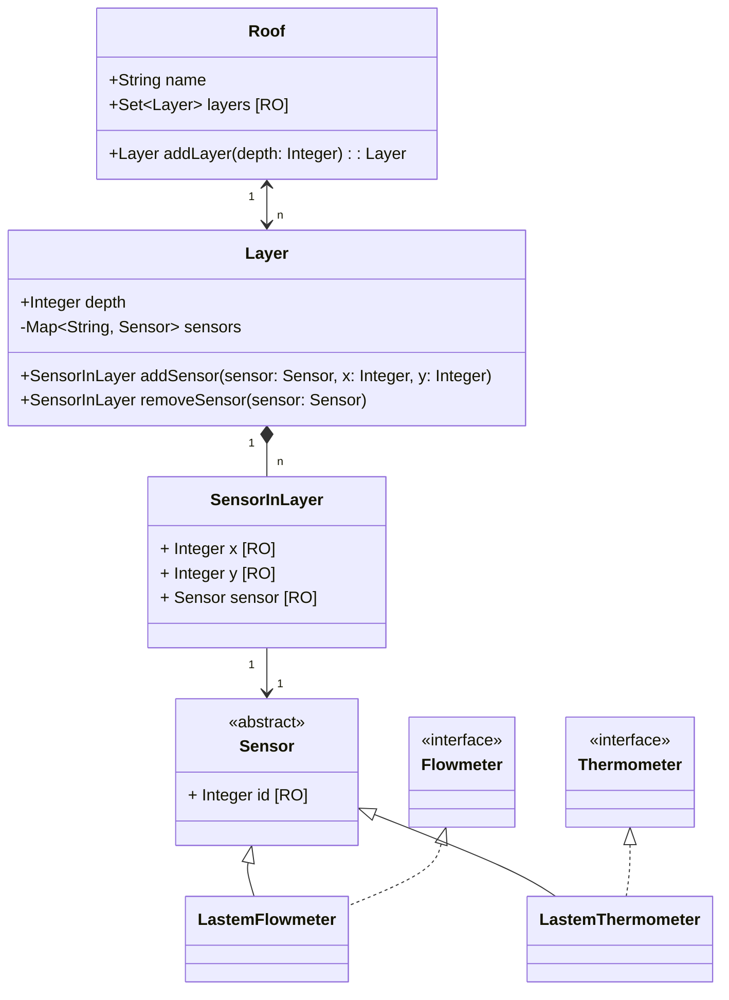

```mermaid
classDiagram
    class Roof{
        +String name
        +Set~Layer~ layers [RO]
        +Layer addLayer(depth: Integer): Layer
    }

    class Layer {
        +Integer depth
        -Map~String, Sensor~ sensors
        +SensorInLayer addSensor(sensor: Sensor, x: Integer, y: Integer)
        +SensorInLayer removeSensor(sensor: Sensor)
        
    }
    Roof "1" <--> "n" Layer

    class SensorInLayer {
        + Integer x [RO]
        + Integer y [RO]
        + Sensor sensor [RO]
    }
    Layer "1" *-- "n" SensorInLayer
    SensorInLayer "1" --> "1" Sensor

    class Sensor {
        <<abstract>>
        + Integer id [RO]
    }

    class Flowmeter {
        <<interface>>
    }

    class Thermometer {
        <<interface>>
    }

    class LastemFlowmeter {

    }
    Sensor <|-- LastemFlowmeter
    Flowmeter <|.. LastemFlowmeter

    class LastemThermometer {

    }
    Sensor <|-- LastemThermometer
    Thermometer <|.. LastemThermometer
```
